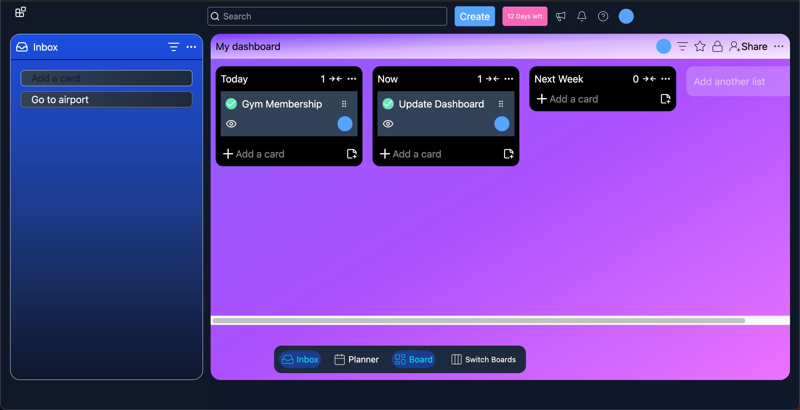
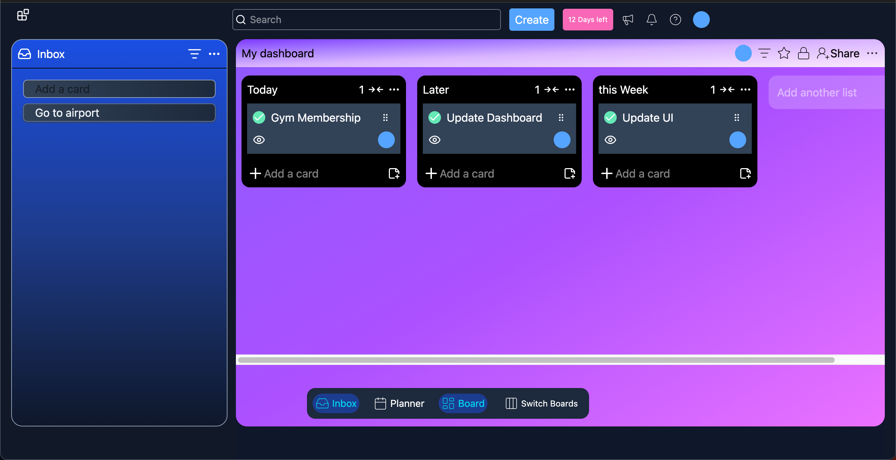
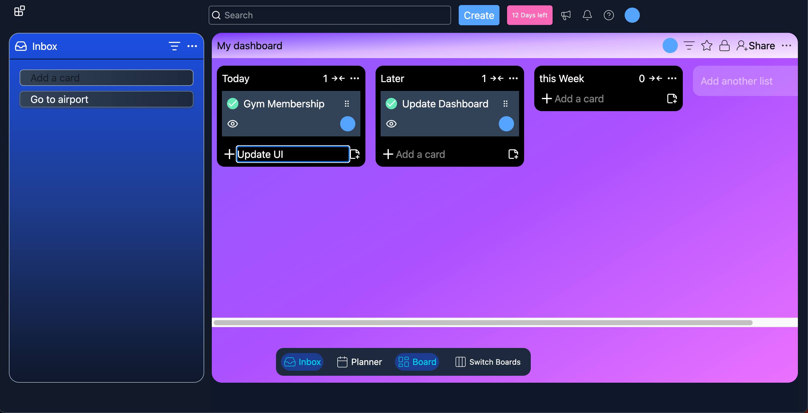
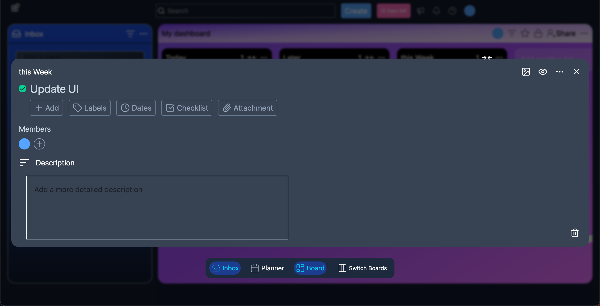
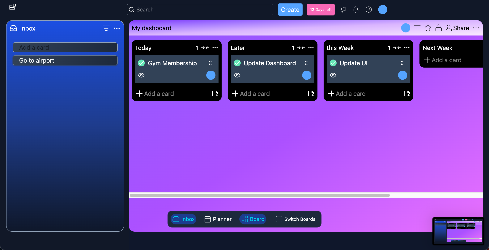
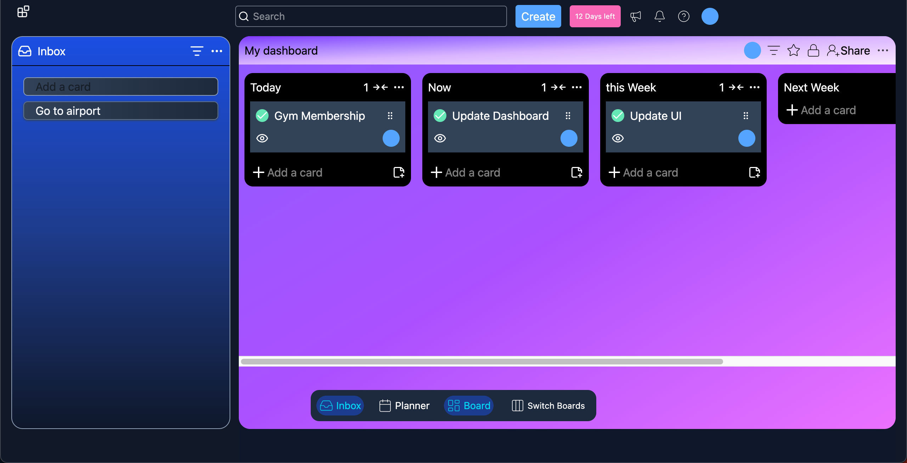

# FlowBoard

FlowBoard is a full-stack Trello-style task management application built with React, Node.js, Express, and MongoDB.

## Features

- User registration and login
- JWT authentication with refresh token flow
- Create, switch, and manage multiple boards
- Create, edit, and delete columns
- Create, edit, and delete tasks
- Drag and drop tasks between columns
- Persistent data storage using MongoDB
- Responsive UI built with Tailwind CSS
- Frontend deployed on Vercel
- Backend deployed on Railway

---

## Tech Stack

**Frontend:** React, Vite, Tailwind CSS, dnd-kit, Axios  
**Backend:** Node.js, Express.js, MongoDB, Mongoose, JWT  
**Deployment:** Vercel, Railway, MongoDB Atlas  

---

## Project Structure

```bash
TRELLO-CLONE/
│
├── client/
│   ├── public/
│   ├── screenshots/
│   ├── src/
│   │   ├── assets/
│   │   ├── components/
│   │   ├── context/
│   │   ├── css/
│   │   ├── hooks/
│   │   ├── pages/
│   │   ├── services/
│   │   ├── App.jsx
│   │   └── main.jsx
│   ├── package.json
│   └── vite.config.js
│
├── server/
│   ├── src/
│   │   ├── config/
│   │   ├── middleware/
│   │   ├── modules/
│   │   │   ├── auth/
│   │   │   ├── boards/
│   │   │   └── tasks/
│   │   └── util/
│   ├── app.js
│   ├── server.js
│   └── package.json
│
└── README.md
```
---
##  Getting Started

Follow these steps to run the project locally.

---

### 1. Clone the repository

```bash
git clone https://github.com/your-username/trello-clone.git
```

### 2. Navigate to project
   ```bash 
   cd trello-clone/client
```
### 3. Install dependencies
   ```bash
   npm install
```
### 4. Start development server
   ```bash 
   npm run dev
```
### 5. Open in browser
   ```bash 
   http://localhost:5173
```

---
## Environment Variables

### Client

Create a `.env.development` file:

```env
VITE_URL=http://localhost:5050
```

Create a `.env.production` file:

```env
VITE_API_URL=https://your-railway-backend-url.up.railway.app
```

### Server

Create a `.env.development` file:

```env
PORT=5050
DB_URI=your_mongodb_connection_string
JWT_SECRET=your_jwt_secret
JWT_REFRESH_SECRET=your_refresh_secret
CLIENT_URL=http://localhost:5173
```

Create a `.env.production` file:

```env
PORT=5050
DB_URI=your_mongodb_connection_string
JWT_SECRET=your_jwt_secret
JWT_REFRESH_SECRET=your_refresh_secret
CLIENT_URL=https://your-vercel-frontend-url.vercel.app
NODE_ENV=production
```
---
## 📸 Preview

###  Dashboard View
A full overview of the task board interface.



---

###  Board Interactions
Column-level actions including add, edit, resize, and move functionality.





---

### ✏️ Task Management
Create, edit, and manage tasks using modal-based interactions.





---

### 🔄 Drag & Drop System
Tasks can be moved dynamically between columns.



---
## Future Improvements

- Implement logout functionality
- Add due dates and task labels
- Enable board sharing and collaboration
- Add activity history for board changes
- Implement search and task filtering
- Migrate the project to TypeScript
- Add automated unit and integration testing
- Implement real-time collaboration with WebSockets
- Support file attachments and comments
- Improve accessibility and keyboard navigation

---

## Author

**Tambowoneyi Zvirevo**

Computer Science Student • Full-Stack Developer

- GitHub: https://github.com/Tambeezy1890
- LinkedIn: https://www.linkedin.com/in/YOUR-LINKEDIN
